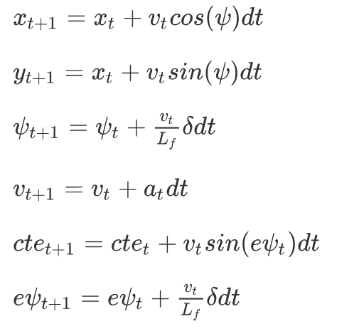
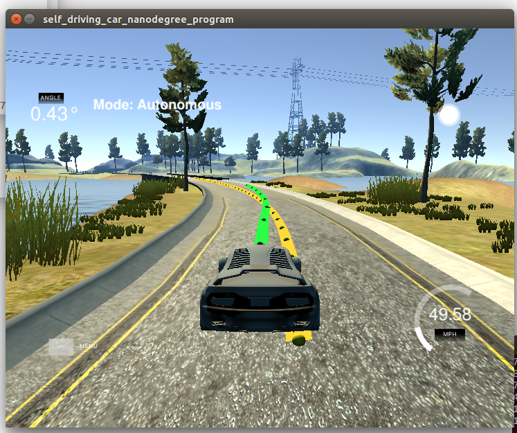

# Controls-MPC
Self-Driving Car Engineer Nanodegree Program

---

## Dependencies

* cmake >= 3.5
 * All OSes: [click here for installation instructions](https://cmake.org/install/)
* make >= 4.1(mac, linux), 3.81(Windows)
  * Linux: make is installed by default on most Linux distros
  * Mac: [install Xcode command line tools to get make](https://developer.apple.com/xcode/features/)
  * Windows: [Click here for installation instructions](http://gnuwin32.sourceforge.net/packages/make.htm)
* gcc/g++ >= 5.4
  * Linux: gcc / g++ is installed by default on most Linux distros
  * Mac: same deal as make - [install Xcode command line tools]((https://developer.apple.com/xcode/features/)
  * Windows: recommend using [MinGW](http://www.mingw.org/)
* [uWebSockets](https://github.com/uWebSockets/uWebSockets)
  * Run either `install-mac.sh` or `install-ubuntu.sh`.
  * If you install from source, checkout to commit `e94b6e1`, i.e.
    ```
    git clone https://github.com/uWebSockets/uWebSockets
    cd uWebSockets
    git checkout e94b6e1
    ```
    Some function signatures have changed in v0.14.x. See [this PR](https://github.com/udacity/CarND-MPC-Project/pull/3) for more details.

* **Ipopt and CppAD:** Please refer to [this document](https://github.com/udacity/CarND-MPC-Project/blob/master/install_Ipopt_CppAD.md) for installation instructions.
* [Eigen](http://eigen.tuxfamily.org/index.php?title=Main_Page). This is already part of the repo so you shouldn't have to worry about it.
* Simulator. You can download these from the [releases tab](https://github.com/udacity/self-driving-car-sim/releases).
* Not a dependency but read the [DATA.md](./DATA.md) for a description of the data sent back from the simulator.


## Basic Build Instructions

1. Clone this repo.
2. Make a build directory: `mkdir build && cd build`
3. Compile: `cmake .. && make`
4. Run it: `./mpc`.


## The Rubric
### 1. Compilation

> Your code should compile.

more to see **Basic Build Instructions**

### 2. Implementation

#### 2.1 The Model

> describes their model in detail. This includes the state, actuators and update equations.

the equation of the MPC model are as follow.





the code of this model is line 112~119 in `MPC.cpp`


#### 2.2 Timestep Length and Elapsed Duration (N & dt)

> discusses the reasoning behind the chosen *N* (timestep length) and *dt* (elapsed duration between timesteps) values. Additionally the student details the previous values tried.

I have chosen N & dt several times, and N is in 6~20, and dt is 0.5~0.01, and obtained a good result when N=0.9 & dt=0.12. A larger N would have a unstable driving when taking a sharp turn. If dt is small i.e. 0.05, the car oscillated back and forth on the straight road(the same as when N is small i.e. N=7), and dt should be near of 


#### 2.3 Polynomial Fitting and MPC Preprocessing

> A polynomial is fitted to waypoints.
>
> If the student preprocesses waypoints, the vehicle state, and/or actuators prior to the MPC procedure it is described.


there are three steps for MPC preprocessing

**step one**, coordinate transformation (line 104~111 of `main.cpp` )

Convert global coordinate points ptsx, ptsy to car local coordinates carpt_x, carpt_y


**step two** Polynomial Fitting (line 112~122 of `main.cpp`)

Because carpt_x/y is std::vector, I transformed it to Eigen::VectorXd by using Eigen::Map, more to see [typecasting Eigen::VectorXd to std::vector][1]

then use `polyfit` to get `coeffs`, use `polyeval` to get `cte`, use `atan`  to get `epsi`


**step three** MPC.Solve (line123~129 of `main.cpp`)

MPC.solve use the `state(0,0,0,v,cte,epsi)` and `coeffs` to calculate steer value  & throttle value, and MPC predicted trajectory


#### 2.4  Model Predictive Control with Latency

> The student implements Model Predictive Control that handles a 100 millisecond latency. Student provides details on how they deal with latency.

the code to handle the latency is in line 102~106 of `MPC.cpp`, I use the previous timestep(almost a dt) to calculate the actuations. Also, acceleration has a certain lag on the impact of car motion.Thus, the combination of velocity and delta(line 62 of `MPC.cpp）`is taken account in cost penalizing  which could control sharp turn of the car. 


### 3. Simulation

> The vehicle must successfully drive a lap around the track.

To see the compressed video in "video" file or simulate by yourself~




[1]: https://stackoverflow.com/questions/26094379/typecasting-eigenvectorxd-to-stdvector

